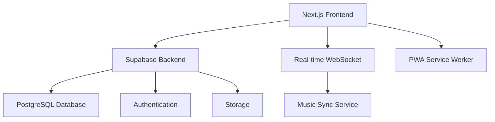
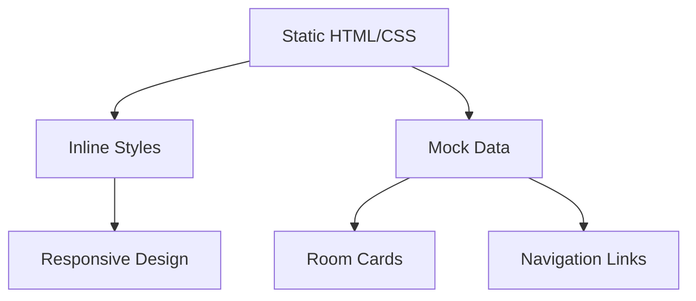

# Системные Паттерны - Music Room

## Архитектура

### Высокоуровневая Диаграмма


### Текущая Архитектура (Упрощенная)


## Ключевые Технические Решения

### Паттерн 1: Минималистичная Архитектура
- **Описание**: Использование максимально простых решений без сложных зависимостей
- **Почему выбран**: Для устранения ошибок гидратации и обеспечения стабильности
- **Как использовать**: Избегать сложных React хуков, предпочитать статичные компоненты

### Паттерн 2: Inline Styles
- **Описание**: Использование inline стилей вместо CSS-in-JS или сложных CSS фреймворков
- **Почему выбран**: Исключает проблемы с гидратацией стилей
- **Как использовать**: Все стили определяются непосредственно в JSX через style prop

### Паттерн 3: Static Data Flow
- **Описание**: Использование статичных данных без сложного state management
- **Почему выбран**: Упрощает отладку и предотвращает ошибки состояния
- **Как использовать**: Данные определяются как константы в компонентах

## Стандарты Кода

### Именование
- **Компоненты**: PascalCase (например, `RoomCard`, `MusicPlayer`)
- **Файлы**: kebab-case для страниц, PascalCase для компонентов
- **Переменные**: camelCase
- **Константы**: UPPER_SNAKE_CASE

### Структура файлов
```
src/
├── app/                 # Next.js App Router
│   ├── layout.tsx      # Root layout
│   ├── page.tsx        # Home page
│   └── globals.css     # Global styles
├── components/         # Reusable components (legacy)
└── lib/               # Utilities (legacy)
```

### Обработка ошибок
- Использование простых try-catch блоков
- Логирование в консоль для разработки
- Graceful fallbacks для пользовательского интерфейса

## Миграционная Стратегия

### Текущее состояние
- Упрощенная версия без React хуков
- Статичные данные и inline стили
- Минимальная конфигурация Next.js

### Планируемая эволюция
1. **Фаза 1**: Добавление базового state management
2. **Фаза 2**: Интеграция с Supabase для аутентификации
3. **Фаза 3**: Real-time функциональность
4. **Фаза 4**: PWA и уведомления

### Принципы миграции
- Постепенное добавление сложности
- Тестирование каждого шага на предмет ошибок гидратации
- Сохранение работоспособности на каждом этапе